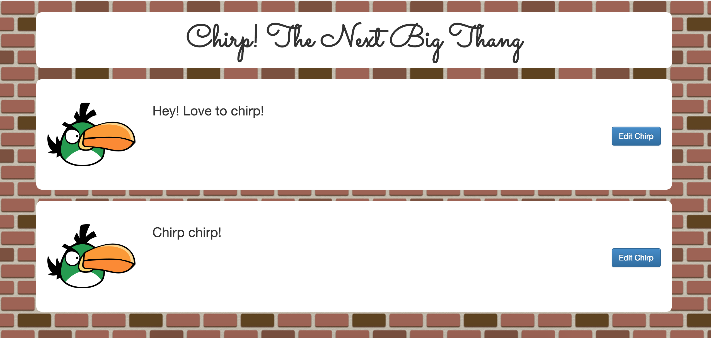

# Chirp! on Rails

## Introduction

- In this lab we will be building a little Twitter clone called Chirp!
- Chirp! will be built as a single-page application using Angular, and powered by Rails.
- The structure will be a little different, with front-end and back-end codebases completely separated.



## Part 1: Building the Core API

- In this part we will be building out the main CRUD functionality as an API using Rails.
- Your job is to look at the attached front end and come up with a Rails app that performs the required actions to make the app work.
- You will need to write tests, code, and then document your endpoints.

## Part 2: Token Authentication with Devise

- For this part we will be implementing token authentication with Devise to secure our API.
- For this part you will need to do two things - configure Devise to accept JSON for authentication, and setup Rails to authenticate header tokens.
- First, generate the devise controllers as per the documentation:

```
rails generate devise:controllers [scope]
```

- We will then tell Devise to respond to JSON:

##### controllers/users/sessions_controller.rb

```ruby
class Users::SessionsController < Devise::SessionsController
	respond_to :json
end
```

##### controllers/users/registrations_controller.rb

```ruby
class Users::RegistrationsController < Devise::RegistrationsController
	respond_to :json
end
```

##### config/routes.rb

```ruby
devise_for :users, :controllers => { registrations: "users/registrations", sessions: "users/sessions" }
```

- Now you can implement the `authenticate_or_request_with_http_token` method in your application controller, using the token you get back from your /users/sign_in endpoint.

## Part 3: Setting Up with Angular

- In this part we will be building out the front-end of the application using Angular.
- Your job is to set up the application as an Angular app and get the Chirp list to show up.

## Part 4: Authentication with Angular

- After you get the main application to show up, the next section will be to implement signup and login pages.
- You will create templates for login and signup, and implement the functionality with your Rails API.
- One way you can store the auth token from your API is to use sessionStorage:

```javascript
sessionStorage.setItem("auth_token", token);
```

- You can then retrieve this value by doing the following:

```javascript
sessionStorage.getItem("auth_token");
```

- Another approach is to use the Angular service $cookies (https://docs.angularjs.org/api/ngCookies/service/$cookies)

## Part 5: Multiple Views

- To complete the app, we will be implementing the $routeProvider service to create multiple views.
- Your job is to complete the application with the full CRUD using the provided template.